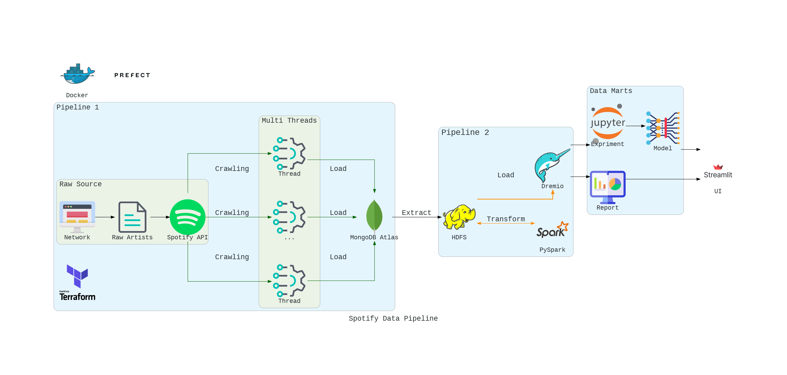

# Spotify Analysis

introduce something

  
  
  
  
  
  
  
  
  

## Table of contents
something

## Prerequisite
- [Docker](https://www.docker.com/products/docker-desktop/)
- [Spotify API account](https://developer.spotify.com/documentation/web-api)
- [MongoDB Atlas](https://www.mongodb.com/cloud/atlas/register)

## Get started
### Set up environment
something here

### Run your pipeline
#### Pipeline 1
something here

#### Pipeline 2
something here

## And more
future update

## About us
greeting to contributors and contacts

something here
