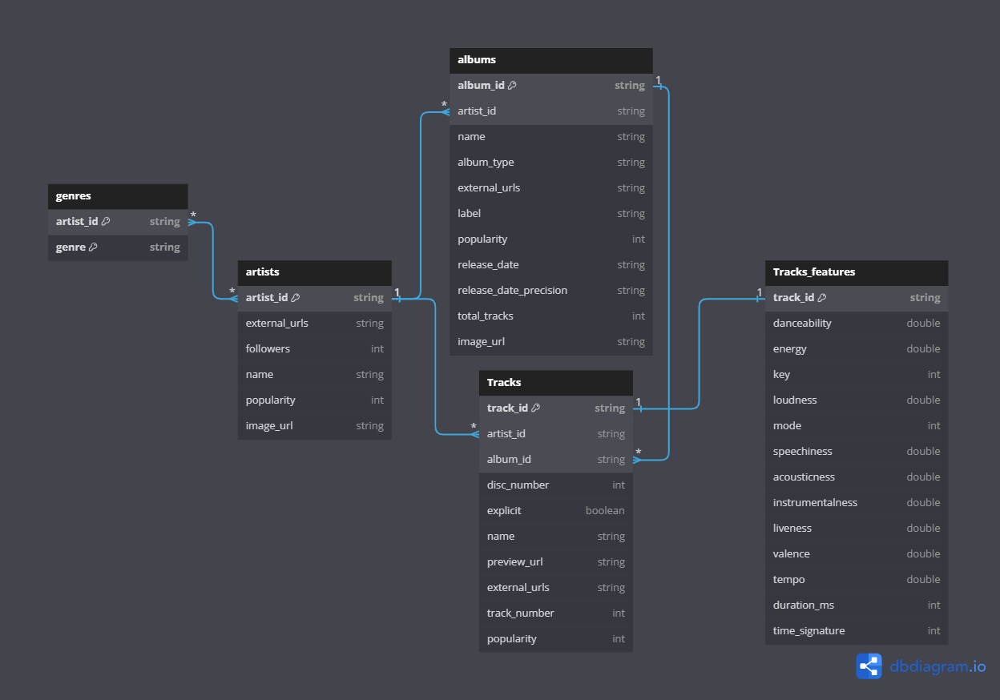
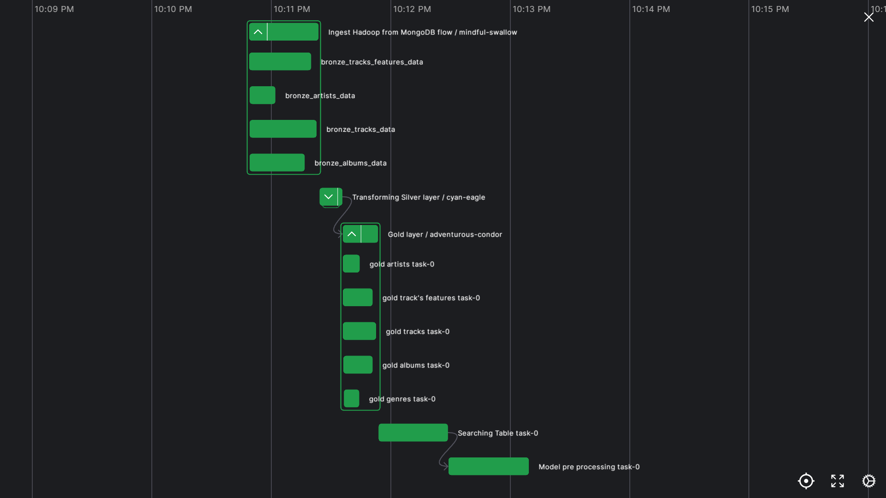

# Spotify Analysis :musical_note:

[](https://opensource.org/licenses/MIT)

This project is aimed at analyzing data from the Spotify platform,
utilizing the Spotify API and MongoDB for data extraction,
Apache Hadoop for ELT processes, PySpark for transformation, and leveraging Dremio 
and Power BI for visualization and in-depth data analysis.

<p align="center">
  
  
  
  
  
  
  
  
  
  
</p>

## Table of contents :pushpin:
- [Overview](#overview)
- [Demo video](#demo-video)
- [Prerequisite](#prerequisite)
- [Getting started](#getting-started)
    - [Set up environment](#set-up-environment)
    - [Run your data pipeline](#run-your-data-pipeline)
    - [Warehouse and UI](#warehouse-and-ui)
- [And more](#and-more)
- [Contributors](#contributors)

## Overview
### Project Structure


### Data Schema
We initiate our data collection by scraping artists's name list from [**Spotify Artists**](https://kworb.net/spotify/artists.html).
Subsequently, leveraging this list, we utilize the Spotify API to extract comprehensive data about each artist.
The obtained raw data undergoes a series of ETL processes.


## Demo Video
This is our demo video on Youtube, you can watch via this [Link](https://www.youtube.com/watch?v=If9-ALcsc8E&t=1s)

## Prerequisite 
- [Terraform](https://developer.hashicorp.com/terraform/tutorials/aws-get-started/install-cli)
- [Docker](https://www.docker.com/products/docker-desktop/)
- [Spotify API account](https://developer.spotify.com/documentation/web-api)
- [MongoDB Atlas](https://www.mongodb.com/cloud/atlas/register)

## Getting started :rocket:
### Set up your MongoDB Atlas 
There are several ways to do in this step, but we will use `terraform` to deploy Atlas cluster.
Please follow this [**Instruction**](./mongo_terraform/)
### Set up environment
Clone this project to your machine by running the following command:
```bash
git clone https://github.com/PhongHuynh0394/Spotify-Analysis-with-PySpark.git
cd Spotify-Analysis-with-PySpark
```
then you need to create `.env` file base on [env_template](./env_template)
```bash
cp env_template .env
```
Now please fill these informations blank in `.env` file, this can be done in [Prerequisite](#prerequisite) and [Set up your MongoDB Atlas](#set-up-your-mongodb-atlas) section:
```
# Spotify
SPOTIFY_CLIENT_ID=<your-api-key>
SPOTIFY_CLIENT_SECRET=<your-api-key> 

# Mongodb
MONGODB_USER=<your-user-name>
MONGODB_PASSWORD=<your-user-password>
MONGODB_SRV=<your-srv-link> # Get this from running terraform set up
```
OK, now it's Docker's job ! Let's build your Docker images of this project by typing `make build` in your
terminal 

> This process might take a few minutes, so just chill and take a cup of coffee :coffee:

**Note: if you failed in this step, just remove the image or restart Docker and try again**

If you've done building Docker images, now its time to run your system. Just type `make run` 

Then check your services to make sure everything work correctly:
1. Hadoop
    - [`localhost:9870`](http://localhost:9870/): Namenode 
    - [`localhost:9864`](http://localhost:9864/): Datanode
    - [`localhost:8088`](http://localhost:8088/): Resources Manager 
2. Prefect
    - [`localhost:4200`](http://localhost:4200/): Prefect Server
3. Data Warehouse
    - [`localhost:9047`](http://localhost:9047/): Dremio (user: `dremio`, password: `dremio123`)
4. Dashboard:
    - [`localhost:8501`](http://localhost:8501/): Streamlit
5. Notebook:
    - [`localhost:8888`](http://localhost:8888/lab): Jupyter Notebook (password is `pass`)

### Run your data pipeline
We use [Prefect](https://www.prefect.io/) to build our data pipeline. When you check out port `4200`, you'll see
prefect UI, let's go to Deployment section, you'll see 2 deployments there correspond to 2 data pipelines
#### Pipeline 1 (Ingest MongoDB Atlas flow)
This data flow (or pipeline) is used to scrape data from spotify API by batch and ingest into
MongoDB Atlas. It will execute automatically every 2 minutes and 5 seconds.
<div style="display: flex; justify-content: space-between;">


</div>

> Tips: The purpose of this flow is preparing your raw data in MongoDB, you would see 
4 collections in your database on MongoDB Atlas after this. You should run this flow a few times before run pipeline 2.

#### Pipeline 2 (ETL flow)
This data flow do ETL job. It Extract raw data from MongoDB and first full load into HDFS in bronze layer,
Then Transforming by PySpark in silver and gold layer. You can trigger this flow by press the `run` button  manually on the top right corner.
> Bronze, Silver, Gold layer are just Data Qualification Directiory to store backup of data in HDFS.

<div style="display: flex; justify-content: space-between;">




</div>

### Warehouse and UI
[`localhost:9047`](http://localhost:9047/)

We use Dremio to analyze data in HDFS directly. Don't forget the username is `dremio` and password is `dremio123`.
Then follow this instruction:

**Login to Dremie** > **Add Source** > **Choose HDFS**

The connecting window will appear, please fill as following:
- Name: HDFS
- NameNode Host: namenode

Then press **Save** to Save your connection. You would see your connection appearing in your main window go to
**gold_layer** directory and format all `.parquet` directories.
Then run your SQL statement and start analyzing. 

You can use our SQL statements in [warehouse.sql](./spotify_analysis/warehouse.sql):

These SQL statements used to create analytic view for `Power Bi` to draw Dashboard. You can also see it in
[**PowerBI Dashboard**](#powerbi-dashboard)

#### UI
##### Streamlit
[`localhost:8501`](http://localhost:8501/)

After all, you can access to Streamlit to see the Dashboard. Moreover, it can also utilize Machine Learning model
to Recommend most porpular songs for you.


##### PowerBI Dashboard
[PowerBI Dashboard](https://app.powerbi.com/reportEmbed?reportId=7ebf3669-88ad-439b-88ed-91cf002eb406&autoAuth=true&ctid=40127cd4-45f3-49a3-b05d-315a43a9f033)


> You can also see it in [powerbi_dashboard](./spotify_analysis/powerbi_dashboard.pdf) Or in our Streamlit app
## And more
In future, we will update this repo in:
- Utilizing Deep Learning model: In the future, we plan to leverage a Deep Learning model, specifically an NLP model, to analyze the lyrics of tracks.
- Using Flask or other frameworks: Our goal is to switch to Flask or other frameworks, replacing the Streamlit Dashboard for improved functionality.
- Using MongoDB locally: To streamline deployment and allow for personalized configuration, we'll be transitioning to using MongoDB locally.

## Contributors 
<table>
  <tbody>
    <tr>
      <td align="center" valign="top" width="14.28%"><a href="https://phonghuynh.netlify.app/"><br /><sub><b>Huỳnh Lưu Vĩnh Phong</b></sub></a><br />Data Engineer <br><b>Team Lead</b><br /></td>
      <td align="center" valign="top" width="14.28%"><a href="https://github.com/TuanTran0910"><br /><sub><b>Trần Ngọc Tuấn</b></sub></a><br /> Data Engineer </td>
      <td align="center" valign="top" width="14.28%"><a href="https://github.com/akanison12"><br /><sub><b>Phạm Duy Sơn</b></sub></a><br />Data Science</td>
      <td align="center" valign="top" width="14.28%"><a href="https://github.com/thiendsu2303"><br /><sub><b>Mai Chiến Vĩ Thiên</b></sub></a><br />Data Analyst </td>
    </tr>
  </tbody>
</table>

## Finally
Feel free to use :smile:

